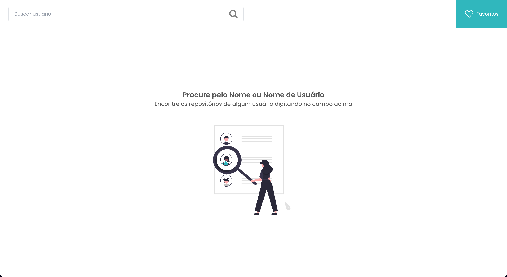

# SearchHub



> Plataforma para buscar dados de usuários do Github e seus repositórios, além disso é possível adicionar ou remover repositórios de seus favoritos.

## 💻 Pré-requisitos

Antes de começar, verifique se você atendeu aos seguintes requisitos:

<!---Estes são apenas requisitos de exemplo. Adicionar, duplicar ou remover conforme necessário--->

- Você instalou a versão mais recente do `< node / npm ou yarn >`
- Você tem uma máquina `<Windows / Linux / Mac >`.

## 🚀 Instalando o projeto <BlogNews> na sua maquina

Para instalar o projeto, siga estas etapas:

Adicione o seu token de acesso pessoal do seu GitHub em um arquivo .env (utilize o arquivo .env.exemple como exemplo)

```bash
NEXT_PUBLIC_GITHUB_ACCESS_TOKEN=
```

Esse token é utilizado no service do axios para fazer as chamadas para a API

```javascript
import axios from "axios";

export const github_api = axios.create({
  baseURL: "https://api.github.com",
  headers: {
    "Content-Type": "application/json",
    Authorization: `token ${process.env.NEXT_PUBLIC_GITHUB_ACCESS_TOKEN}`,
  },
});
```

Linux e macOS:

```bash
git clone https://github.com/alextfonseca/Teste-Tecnico-Front-end-Casar.com
$ cd Teste-Tecnico-Front-end-Casar.com
$ yarn ou npm install
$ yarn dev ou npm dev
```

Windows:

```bash
git clone https://github.com/alextfonseca/Teste-Tecnico-Front-end-Casar.com
$ cd Teste-Tecnico-Front-end-Casar.com
$ yarn ou npm install
$ yarn dev ou npm dev
```

## 🧾 Projeto hospedado na vercel

# <a href="https://teste-tecnico-front-end-casar-com.vercel.app/">Acesse o projeto</a>

## 🧑‍💻 Criador

<table>
  <tr>
    <td align="center">
      <a href="https://github.com/alextfonseca">
        <br>
        <sub>
          <b>Alex Teixeira da Fonseca</b>
        </sub>
      </a>
    </td>
  </tr>
</table>

## 😄 Me siga nas redes sociais<br>

<p align="left">

  <a href="https://www.linkedin.com/in/alex-teixeira-da-fonseca-5a99931a2/" alt="Linkedin">
  </a>

  <a href="https://wa.me/+5511976184659?text=Olá%20Alex" alt="WhatsApp">
  </a>

  <a href="https://www.instagram.com/devalextf/?hl=pt-br" alt="Instagram">
  </a>
</p>
